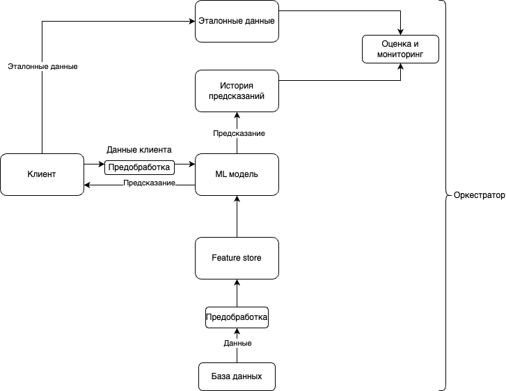

# ML-модель для распознавания аномалий на АЗС

---

## Содержание

1. [Описание проекта](#описание-проекта)
2. [Архитектура проекта](#архитектура-проекта)
3. [Стэк проекта](#cтэк-проекта)
4. [Требования к окружению](#требования-к-окружению)

---

## Описание проекта

Этот репозиторий содержит ML-модель для распознавания аномалий на автозаправочных станциях. Модель предназначена для анализа данных, собираемых с АЗС, и выявления поведений, таких как несанкционированные транзакции или технические сбои.

---

## Архитектура проекта

Архитектура проекта

---

## Стэк проекта

1. Хранение и обработка данных

    - База данных: PostgreSQL 

    - Feature Store: Feast.

    - ETL-инструменты: Loginom, Polyanalyst, Python.

    - Форматы хранения данных: CSV

2. Обработка и анализ данных

    - Язык программирования: Python

    - Библиотеки для работы с данными: pandas, numpy, scipy

    - Библиотеки для работы с базами данных: SQLAlchemy, psycopg2 для взаимодействия с PostgreSQL.

3. Развертывание

    - Контейнеризация: Docker

    - Оркестрация: Airflow
    
    - Сервис обработки данных: Apache Kafka

4. Визуализация и мониторинг

    - BI-система: Visiology
    
    - Библиотеки визуализации: matplotlib, seaborn, plotly.
    
    - Система мониторинга модели: Grafana.

---

## Требования к окружению

Для работы данного проекта необходимы:

- Python: версия 3.8 или выше
- библиотеки:
    - pandas: версия 2.2.3
    - numpy: версия 2.2.3
    - scipy: версия 1.15.2
    - SQLAlchemy: версия 2.0
    - psycopg2: версия 2.9.10
    - matplotlib: версия 3.10.0
    - seaborn: версия 0.13.2
    - plotly: версия 6.0.0
    - apache-kafka-python: версия 2.0.2

